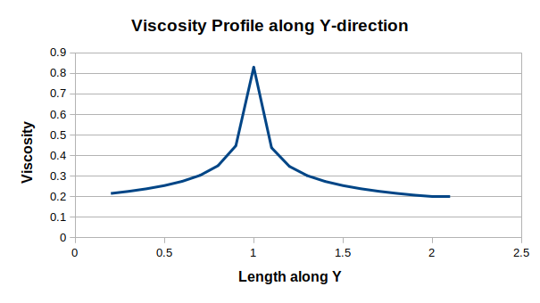

## Simulating Non-Newtonian Shear Thinning Fluids
*Group B*

*Manish Mishra, Irene Angelucci, Basak Kapusuzoglu*

### Theory
Newton's law of viscosity, which assumes a constant viscosity under stress, is one of the most commonly applied assumption in flow simulations. However, this assumption doesn't hold for a variety of fluids. These are referred to as Non-Newtonian fluids and are typically classified into 4 types. Rheopectic and Thixotropic fluids change viscosity with stress applied over time. Rheopectic fluids show an increase in viscosity while Thixotropic fluids show a decrease in viscosity over time under an applied stress. Dilatant (Shear Thickening) and Pseudoplastic (Shear Thinning) fluids show a change in viscosity with shear rate. As the name suggests, Shear thickening fluids show an increase in viscosity with increased shear rate while Shear thinning fluids show a decrease in viscosity at high shear rates.

 

<em> Viscosity variation with stress over time for Rheopectic and Thixotropic fluids </em>

 

<em> Viscosity variation with shear rate for Shear thickening and Shear thinning fluids </em>

Shear thinning is a phenomenon characteristic of some non-Newtonian fluids in which the fluid viscosity decreases with increasing shear stress. Shear thickening is the opposite phenomenon. Shear thinning proves useful in many applications, from lubricating fast-moving engine parts to making an otherwise stiff biocompatible hydrogel injectable. Common examples include ketchup, paints and blood. 

 

<em> Velocity profile comparision for Shear thickening and Shear thinning fluids with a newtonian fluid </em>

In the present study, we focus on extending Fluidchen to simulate shear thinning fluid (with application focus on blood flow) using Wallburn-Schneck Model by explicitly updating viscosity at each point in each timestep. One of the key parameters studied in the blood flow simulation is the Wall Shear Stress (WSS) which will the focus of present study along with typical parameters like pressure drop, flow rate (velocity), etc.

### Objectives
1. Simulate blood as a Shear thinning fluid and observe the effect of non Newtonian viscosity model on pressure drop, velocity profile, WSS, etc.
2. To understand scenarios where non Newtonian models are crucial for simulating the actual flow.

### Modified Algorithm
To implement a non-Newtonian model, following changes are made to Fluidchen:

1. Defining and initializing a Viscosity field. Viscosity is defined on top-right corner of cell on the staggered grid.
2. Flux Computation with local viscosity at edge center obtained by averaging the viscosity at corner points.
3. Computing shear rate (ɣ) and updating viscosity at each point (for all fluid cells) using the updated velocities.
4. Calculating time step size for next iteration with maximum viscosity in the domain.

 

<em> Viscosity on the Staggered Grid</em>

 

<em> Modified algorithm for a parallel Non-Newtonian simulation using MPI </em>

### Pipe Flow with Inflow Boundary
We selected flow in a pipe as the base case for our study because of its simplicity and resemblance to the actual problem of blood flow in arteries. We began with simulating newtonian flow to establish ground results to compare non-newtonian simulations with later on. However, we observed that the velocity profile along the y-direction remains unchanged (same parabolic profile) for different viscosity values at the steady state. As we looked closely, we realized that this can be attributed to the physics of the problem at the steady state and uniform velocity inflow boundary condition. Derivation is shown below for reference. However, in this case, we get a straight forward relationship between WSS and viscosity. As the velocity profile remains unchanged, WSS is directly proportional to the viscosity (or inversely proportional to the Re).

 

<em>Derivation showing cross-section velocity profile in a pipe flow with inflow bounday condition is independent of the viscosity </em>

Re for blood flow in arteries is ~1000. We carried out both Newtonian & Non-Newtonian simulations at Re 3000 & Re 300 and compared the WSS for both cases. Velocity profile along cross section was similar for the reasons explained above (except slightly flattened near the center), however the viscosity for non Newtonian case was slightly different. In both the cases, we obtained a lower WSS for non-Newtonian case. For Re 3000, the difference was about ~0.4% while for Re 300, the difference was as high as ~4%. However, if we consider minimum viscosity for calculating the Reynolds number, we will see that there is no effect of Re on the WSS.

 

<em> Viscosity field (left) and Velocity field (right) for Non-Newtonian simulation of a pipe flow with limiting viscosity 0.2  </em>

 

<em> Plots comapring pressure variation along length (left) and velocity profile along cross section (right) for Newtonian and Non-Newtonian simulation of a pipe flow with limiting viscosity 0.2  </em>

 

<em> Viscosity variation along cross-section for Non-Newtonian simulation of a pipe flow with limiting viscosity 0.2  </em>

We observe that velocity profile is flatterr for the Non-Newtonian case near the centre due to high viscosity. We see a ~8% higher pressure drop for the Non-Newtonian simulation which can also be attributed to the higher viscosity in the domain. The main problem with these simulation remains that we don't see any significant change in the velocity profile for the Non-Newtonian flow for the same reasons as described for effect of viscosity on velocity field for Newtonian flow.

### Pressure Driven Pipe Flow
To circumvent the problem, we moved towards pressure-driven flow simulation. In this case, the pressure (and hence the pressure gradient) is constratint causing the velocity variation to be dependent on the viscosity (this can be seen in the last expression in the derivation above). This case is also much closer to the human body where the heart pumps the blood with a certain pressure (although the pressure is not constant but cyclic). 

We carried out Newtonian and Non-Newtonian simulation with viscosity 0.2 (for non-Newtonian case, this value represents the viscosity when the power law coefficient goes to zero, i.e. limiting Newtonian viscosity). With a fixed pressure drop of 1 unit over the entire length, we obtained ~40% higher WSS in Non-Newtonian case. We observed that the velocity gradient at wall was smaller but viscosity was much higher, leading to the higher WSS. However, this difference can be simply attributed to the difference in Re. Re for non-Newtonian case is ~45% of Re for the Newtonian simulation. Note that Re is calculated with peak velocity and viscosity near the wall (which is also the minimum value in the domain).

In the scaled velocity profile, we observe the expected trend. The velocity profile is steeper near the wall while flatter at the top when compared to the velocity profile for Newtonian case.

 

<em>Velocity profiles actual (left) and scaled(right) for Newtonian and Non-Newtonian simulation for pressure-driven flow with viscosity 0.2 </em>

 

 

<em> Viscosity field (left) and Velocity field (right) for Non-Newtonian Pressure-driven simulation of a pipe flow with limiting viscosity 0.2  </em>

To be able to compare the Newtonian and Non-Newtonian case, we repeated the Non-Newtonian simulation with limiting viscosity 0.15. Re for this case is much closer to the Newtonian case (less than 10% difference) and we observe ~15% higher WSS. The results are tabulated below.

Case | Viscosity  | Reynolds Number | WSS |
--- | --- | --- | --- |
Newtonian | 0.2  | 1370 | 0.053 |
Non Newtonian | 0.2 (0.32)  | 610 | 0.071 |
Non Newtonian | 0.15 (0.22) | 1270 | 0.070 |

*Viscosity value in bracket denotes the actual minimum value*

 

<em>Velocity profiles for Newtonian and Non-Newtonian simulations for pressure-driven flow </em>

For higher viscosity, pressure driven flow simulation becomes unstable for the specified pressure drop of 1 unit.

### Channel with step

We conducted similar simulations for a Channel with step and a channel with Obstacle in order to consolidate our results and to seewheter some differences could be found.
We started by simulating a non Newtonian fluid in a channel with step and inflow BC. The limiting viscosity was taken equal to 0.2, for sake of comparison to the pipe flow case.

 

<em> Viscosity field (left) and Velocity field (right) for Non-Newtonian simulation of a channel with step with inflow BC and limiting viscosity 0.2  </em>

 

<em> Plots comapring pressure variation along length (left) and velocity profile along cross section (right) for Newtonian and Non-Newtonian simulation of a channel with step with inflow BC and limiting viscosity 0.2  </em>

 

<em> Viscosity variation along cross-section for Non-Newtonian simulation of a channel with step with inflow BC and limiting viscosity 0.2  </em>

As we have already seen for the pipe flow case, the change in velocity profile along the y-axes is extremely small and in this case it is even nearly noticeable. We have therefore conducted a new simulation, using a pressure driven flow, with a constant pressure drop of 1 unit over the entire length.

 

<em> Viscosity field (left) and Velocity field (right) for Non-Newtonian simulation of a channel with step for a pressure-driven flow with limiting viscosity 0.2  </em>

 

<em>Velocity profiles actual (left) and scaled(right) for Newtonian and Non-Newtonian simulation for pressure-driven flow with viscosity 0.2 </em>

### Channel with Obstacle

### Discussion
1. The extent of the effect of Non-Newtonian model depends on the specific problem, geometry, Re, and boundary conditions. 
2. Wall shear stress (WSS), a critical parameter for blood flow simulations, varies inversely with Reynolds number.
3. Inflow boundary condition leads to same steady state velocity profile in pipe flow for the Newtonian case. A slight difference, flattened profile near the center, is observed for the non Newtonian case.
4. Pressure driven flow yields different velocity profile for same applied pressure drop across it. Significant difference in WSS is observed for same Re flow with Newtonian and Non-Newtonian model highlighting the need of Non-Newtonian model for blood flow simulation.
5. Non Newtonian effects are dominant in unsteady cases at low Re (high viscosity), or cases with large shear rates, like flow in curved pipe, etc.
6. While a Newtonian model may suffice for a first simulation of blood flow, a Non Newtonian model may be crucial for a detailed simulation and evaluation of parameters like the WSS.