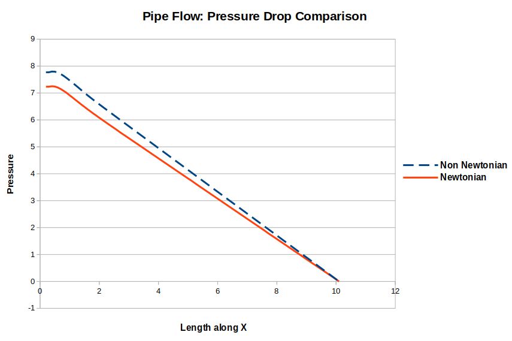

## Simulating Non-Newtonian Shear Thinning Fluids
*Group B*

*Manish Mishra, Irene Angelucci, Basak Kapusuzoglu*

### Theory
There are four types of Non Newtonian fluids. Those types are Rheopectic, Thixotropic, Dilatant and Pseudoplastic.
Viscosity vs Stress graphs of these different types are:

 

 

Shear thinning is a phenomenon characteristic of some non-Newtonian fluids in which the fluid viscosity decreases with increasing shear stress. Shear thickening is the opposite phenomenon. Shear thinning proves useful in many applications, from lubricating fast-moving engine parts to making an otherwise stiff biocompatible hydrogel injectable.

 

Common examples include ketchup, paints and blood. 

### Objective
1. Simulate blood and observe the effect of non newtonian model
2. To understand scenarios where non newtonian models are significant
 

### Modified Algorithm
The things we have done after Fluidchen are:

1. Defining and Initializing viscosity field
2. Flux Computation with viscosity at the given point
3. Computing shear rate (ɣ) and updating viscosity at each point (fluid cells), after calculating new velocities
4. Calculating time step size for next iteration with maximum viscosity

and the modified algorithm is:

 

### Pipe Flow with Inflow Boundary
We selected flow in a pipe as the base case for our study because of its simplicity and resemblance to the actual problem of blood flow in arteries. We began with simulating newtonian flow to establish ground results to compare non-newtonian simulations with later on. However, we observed that the velocity profile along the y-direction remains unchanged (same parabolic profile) for different viscosity values at the steady state. As we looked closely, we realized that this can be attributed to the physics of the problem at the steady state and uniform velocity inflow boundary condition. Derivation is shown below for reference. However, in this case, we get a straight forward relationship between WSS and viscosity. As the velocity profile remains unchanged, WSS is directly proportional to the viscosity (or inversely proportional to the Re).

 

<em>Derivation showing cross-section velocity profile in a pipe flow with inflow bounday condition is independent of the viscosity </em>

Re for blood flow in arteries is ~1000. We carried out both Newtonian & Non-Newtonian simulations at Re 3000 & Re 300 and compared the WSS for both cases. Velocity profile along cross section was same for the reasons explained above, however the viscosity for non Newtonian case was slightly different. In both the cases, we obtained a lower WSS for non-Newtonian case. For Re 3000, the difference was about ~0.4% while for Re 300, the difference was as high as ~4%. However, if we consider minimum viscosity for calculating the Reynolds number, we will see that there is no effect of Re on the WSS.

 

<em> Viscosity field (left) and Velocity field (right) for Non-Newtonian simulation of a pipe flow with limiting viscosity 0.2  </em>

 

<em> Viscosity field (left) and Velocity field (right) for Non-Newtonian simulation of a pipe flow with limiting viscosity 0.2  </em>

We observe that velocity profile is flatterr for the Non-Newtonian case near the centre due to high viscosity. We see a ~8% higher pressure drop for the Non-Newtonian simulation which can also be attributed to the higher viscosity in the domain. The main problem with these simulation remains that we don't see any significant change in the velocity profile for the Non-Newtonian flow for the same reasons as described for effect of viscosity on velocity field for Newtonian flow.

### Pressure Driven Pipe Flow
To circumvent the problem, we moved towards pressure-driven flow simulation. In this case, the pressure (and hence the pressure gradient) is constratint causing the velocity variation to be dependent on the viscosity (this can be seen in the last expression in the derivation above). This case is also much closer to the human body where the heart pumps the blood with a certain pressure (although the pressure is not constant but cyclic). 

We carried out Newtonian and Non-Newtonian simulation with viscosity 0.2 (for non-Newtonian case, this value represents the viscosity when the power law coefficient goes to zero, i.e. limiting Newtonian viscosity). With a fixed pressure drop of 1 unit over the entire length, we obtained ~40% higher WSS in Non-Newtonian case. We observed that the velocity gradient at wall was smaller but viscosity was much higher, leading to the higher WSS. However, this difference can be simply attributed to the difference in Re. Re for non-Newtonian case is ~45% of Re for the Newtonian simulation. Note that Re is calculated with peak velocity and viscosity near the wall (which is also the minimum value in the domain).

In the scaled velocity profile, we observe the expected trend. The velocity profile is steeper near the wall while flatter at the top when compared to the velocity profile for Newtonian case.

 

<em>Velocity profiles actual (left) and scaled(right) for Newtonian and Non-Newtonian simulation for pressure-driven flow with viscosity 0.2 </em>

 

 

<em> Viscosity field (left) and Velocity field (right) for Non-Newtonian Pressure-driven simulation of a pipe flow with limiting viscosity 0.2  </em>

To be able to compare the Newtonian and Non-Newtonian case, we repeated the Non-Newtonian simulation with limiting viscosity 0.15. Re for this case is much closer to the Newtonian case (less than 10% difference) and we observe ~15% higher WSS. The results are tabulated below.

Case | Viscosity  | Reynolds Number | WSS |
--- | --- | --- | --- |
Newtonian | 0.2  | 1370 | 0.053 |
Non Newtonian | 0.2 (0.32)  | 610 | 0.071 |
Non Newtonian | 0.15 (0.22) | 1270 | 0.070 |

*Viscosity value in bracket denotes the actual minimum value*

 

<em>Velocity profiles for Newtonian and Non-Newtonian simulations for pressure-driven flow </em>

For higher viscosity, pressure driven flow simulation becomes unstable for the specified pressure drop of 1 unit.

### Channel with step

### Channel with Obstacle

### Discussion
1. WSS shear stress varies inversely with Reynolds number.
2. The extent of the effect of Non-Newtonian model depends on the specific problem, geometry, Re, and boundary conditions.
3. Inflow boundary condition leads to same steady state velocity profile in pipe flow for the Newtonian case. A slight difference, flattened profile near the center, is observed for the non Newtonian case.
4. Pressure driven flow yields different velocity profile for same applied pressure drop across it. Significant difference in WSS is observed for same Re flow with Newtonian and Non-Newtonian model highlighting the need of Non-Newtonian model for blood flow simulation.
5. Non Newtonian effects are dominant in unsteady cases at low Re (high viscosity), or cases with large shear rates, like flow in curved pipe, etc.
6. While a Newtonian model may suffice for a first simulation of blood flow, a Non Newtonian model may be crucial for a detailed simulation and evaluation of parameters like the WSS.