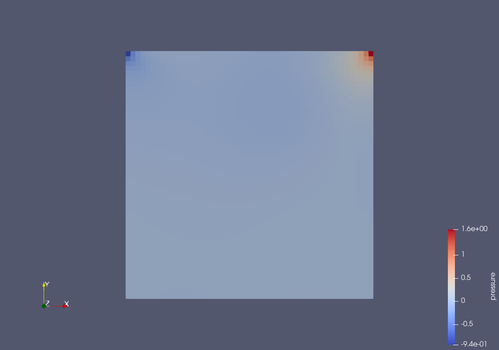
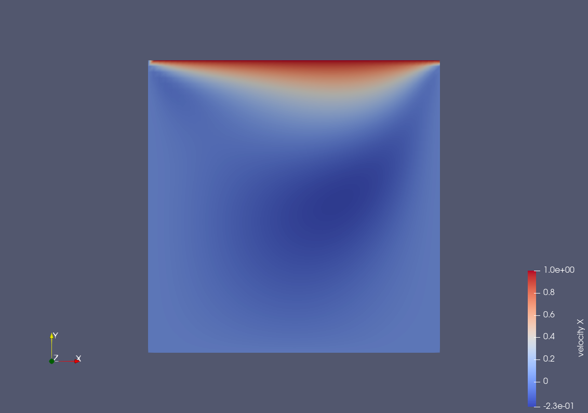
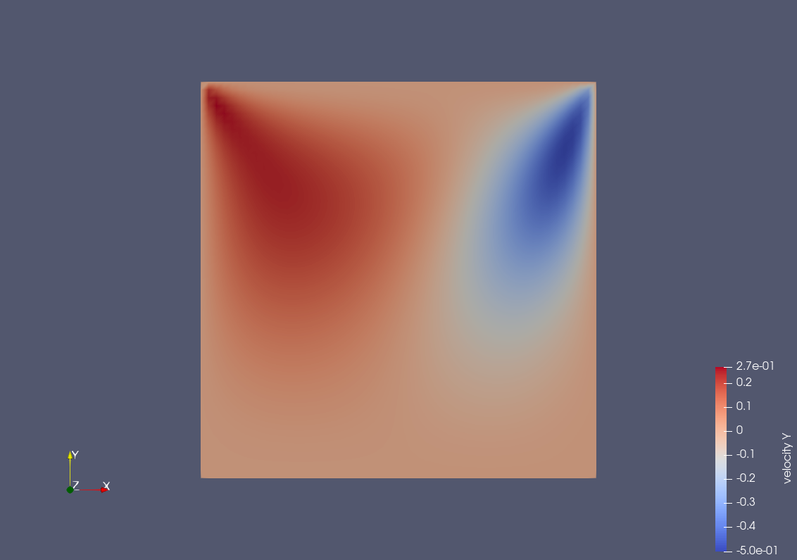
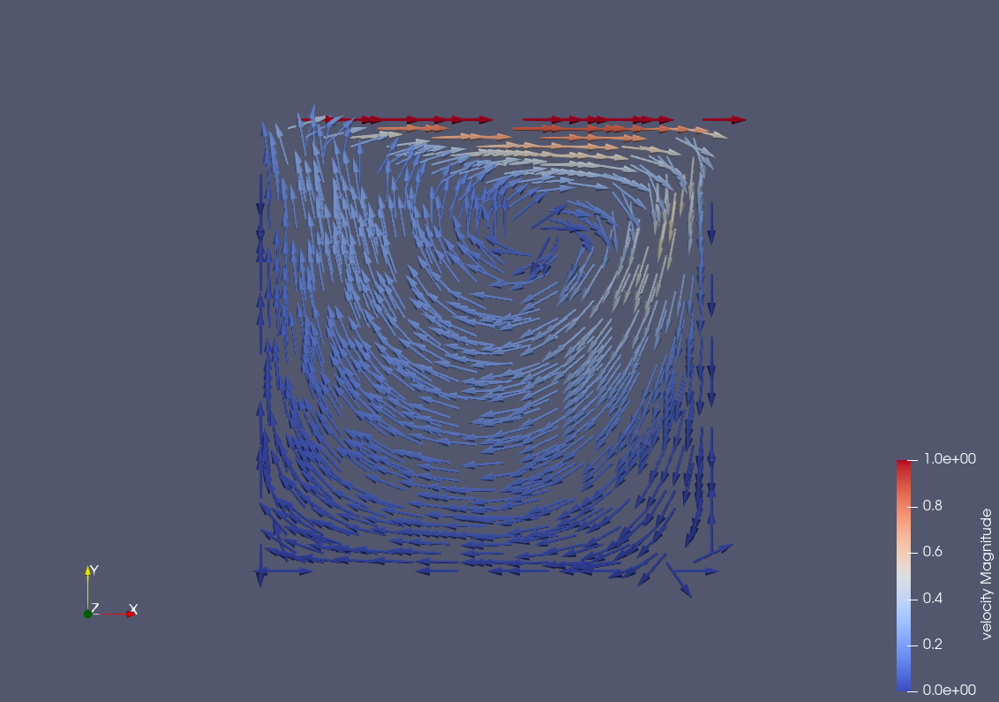

### Pressure Visualization

The image below shows the pressure contour for the lid driven cavity simulation, after some thousands time steps. As the picture shows, the highest pressure is in the upper right corner of the lid driven cavity while the lowest pressure is observed at the left upper corner. If ome also takes a look at the glyphs in the velocity profile (next section), then it's obvious that the fluid moves from high pressure to low pressure. The only exception is the top of the cavity. Here the cells used for the discretization are "attached" to the lid and hence move with it (from low pressure to high pressure). 

### Velocity Visualization

A expected, velocity is zero at left, right and bottom boundaries, while it's equal to the lid's velocity (one) at the top boundary, where cells are attached to the lid (as explained in the previous section).

### Examination of SOR solvers behavior depending on ω

To examine the SOR solver's behaviour depending on the relaxation factor ω, we conducted the simulation with different values of ω and for each one of these and for each time step, we searched for the maximum number of iterations necessary for the solver to converge (res < eps). Among the ω values we used, the one that required less iterations to converge was ω=1.9. For very low values of ω a very large number of iterations is necessary to obtain convergence. That's consistent with the SOR solver formulation since p(n+1)->p(n) for ω->0. In the table below we report also the time step at which the max iteration is reached, i.e. the time step that required the maximum number of iterations to converge.

ω | max-iter | timestep |
--- | --- | --- |
0.5 | 3499 | 592 |
--- | --- | --- |
1.0 | 1132 | 1992 |
--- | --- | --- |
1.3 | 655 | 1992 |
--- | --- | --- |
1.6 | 346 | 1992 |
--- | --- | --- |
1.7 | 260 | 1992 |
--- | --- | --- |
1.8 | 176 | 1992 |
--- | --- | --- |
1.9 | 154 | 1992 |
--- | --- | --- |
1.95 | 295 | - |
--- | --- | --- |
1.99 | 1350 | - |

### The algorithm’s behavior depending on δt

In our code we provided an implementation for adapting the time step size δt in accordance to the stability condition in Equation (13). However, in order to analyse the algorithm's behaviour depending on δt, we kept it constant and equal to the values reported in the table below throughout the whole simulation. We observed divergence for the time steps 0.01, 0.03 and 0.05 and convergence for time steps 0.005, 0.007 and 0.009.

dt | timestep | stabilitiy condition |
--- | --- | --- |
0.05 | 5 | div |
--- | --- | --- |
0.03 | 7 | div |
--- | --- | --- |
0.01 | 71 | div |
--- | --- | --- |
0.005 | - | conv |
--- | --- | --- |
0.007 | - | conv |
--- | --- | --- |
0.009 | - | conv |

### The algorithm’s behavior depending on i_max = j_max

We also studied the algorithm's behaviour when using different values of i_max an j_max. The bigger i_max=j_max gets, the finer the grid gets (smaller dx and dy). To ensure the stability condition (Equation 12), δt also has to smaller. We conducted our simulations for varying values of i_max=j_max, but always keeping δt constant to 0.05. We then looked at u(i_max/2, 7*j_max/8) at the end of the simulation for each one of these time steps. The only plausible result we obtained was for i_max=j_max=16. For the increasing values of imax and jmax, we observed divergence. In order to obtain plausible results also for bigger values of i_max=j_max we would need to decrease the time step size δt. 

imax/jmax | (i,j) | u(i,j) |
--- | --- | --- |
16 | (8,14) | 0.183833 |
--- | --- | --- |
32 | (16,28) | -nan |
--- | --- | --- |
64 | (32,56) | -nan |
--- | --- | --- |
128 | (64,112) | +nan |
--- | --- | --- |
256 | (128,224) | +nan |

### Effect of kinematic viscosity

We investigated the effect of kinematic viscosity on our simulation. We looked at the velocity profile for different values of kinematic viscosity nu. For lower values of viscosity the effect of the moving lid can propagate deeper into the fluid. However, for lower viscosity, the velocity magnitude is very high only for regions of fluid that are very close to the lid. For bigger viscosity, the region of "big" (close to 1) velocity magnitude extends more but is then immediately lost (the rest of the cavity is at values very close to zero).

nu = 0.01 :
 |  

nu = 0.002 :
 |  

nu = 0.0005 :
 |  

nu = 0.0001 :
 |  
